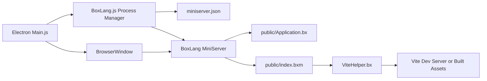
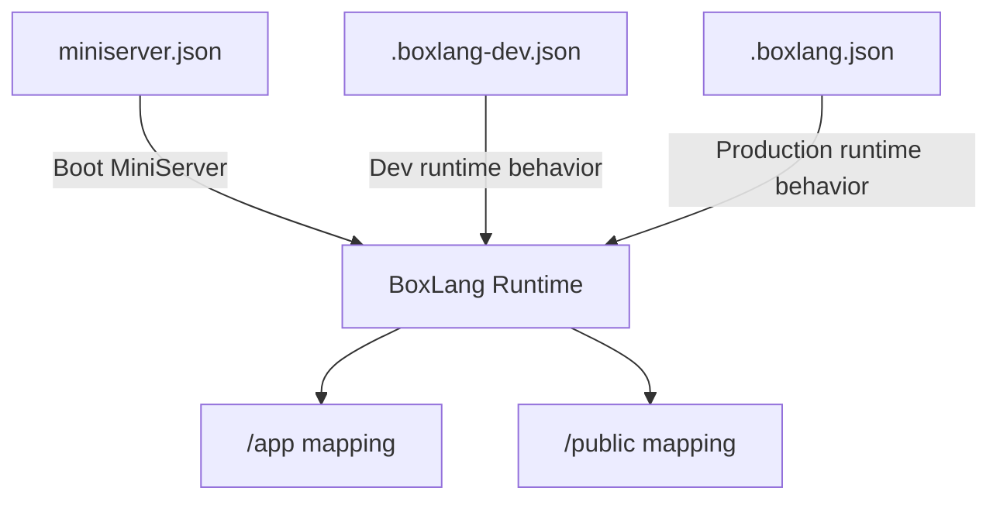

# ⚡ BoxLang Desktop Electron Starter App

```
|:------------------------------------------------------:|
| ⚡︎ B o x L a n g ⚡︎
| Dynamic : Modular : Productive
|:------------------------------------------------------:|
```

<blockquote>
 Copyright Since 2023 by Ortus Solutions, Corp
 <br>
 <a href="https://www.boxlang.io">www.boxlang.io</a> |
 <a href="https://www.ortussolutions.com">www.ortussolutions.com</a>
</blockquote>

<p>&nbsp;</p>

🚀 **Production-ready runtime** to build desktop apps with BoxLang, Electron, and Vite from one starter project.

## What This Starter Gives You

- BoxLang MiniServer running locally inside the desktop app
- Electron shell with menu, tray, shortcuts, and native window lifecycle
- Vite build pipeline for JS and SCSS assets
- Simple full packaging flow for macOS, Windows, and Linux

## How it works

### Architecture diagram



### Runtime flow

1. Electron starts from `app/electron/Main.js`.
2. `Main.js` wires app modules: `AppMenu`, `TrayMenu`, `Shortcuts`, and `BoxLang`.
3. `BoxLang.js` starts MiniServer using `miniserver.json`.
4. Electron waits until the server URL is reachable, then loads it in the main window.

### MiniServer behavior

- Packaged runtime location: `runtime/bin` and `runtime/lib`.
- Packager script: `runtime/Package.bx`.
- Target version source: `.bvmrc`.
- Startup preference: packaged MiniServer first, global `boxlang-miniserver` as fallback.
- Unix self-heal: execute permissions are applied automatically when needed.
- `miniserver.json` is your main local server control file in development (host, port, webRoot, rewrites, debug, envFile).

### Runtime config files (dev vs production)

- `.boxlang-dev.json`: development runtime settings (debug and cache behavior), plus test mappings.
- `.boxlang.json`: production/runtime defaults for packaged execution.
- Both files already include the app mappings below, so your classes and templates resolve out of the box.

```json
"/app": {
 "path": "${user-dir}/app",
 "external": false
},
"/public": "${user-dir}/public"
```

### Config relationship diagram



### Web app layer

- `public/Application.bx`: application settings and datasource bootstrap.
- `public/index.bxm`: default landing page.
- `public/includes/helpers/ViteHelper.bx`: resolves assets for dev and production.

### Frontend layer

- Source: `resources/assets/js` and `resources/assets/scss`.
- Build config: `vite.config.mjs`.
- Output: `public/includes/resources`.

### Desktop layer

- `app/electron/Main.js`: lifecycle, logging, BrowserWindow creation.
- `app/electron/BoxLang.js`: process control, health checks, restart strategy.
- `app/electron/AppMenu.js`: app menu.
- `app/electron/TrayMenu.js`: tray menu and status.
- `app/electron/Shortcuts.js`: global keyboard shortcuts.

### Electron Resources

- `app/electron/Main.js`
  - Electron app lifecycle: <https://www.electronjs.org/docs/latest/api/app>
  - BrowserWindow: <https://www.electronjs.org/docs/latest/api/browser-window>
  - NativeImage (icons): <https://www.electronjs.org/docs/latest/api/native-image>
- `app/electron/BoxLang.js`
  - Child processes: <https://nodejs.org/docs/latest/api/child_process.html>
  - Process events/signals: <https://nodejs.org/docs/latest/api/process.html>
- `app/electron/AppMenu.js`
  - Menu: <https://www.electronjs.org/docs/latest/api/menu>
  - MenuItem: <https://www.electronjs.org/docs/latest/api/menu-item>
- `app/electron/TrayMenu.js`
  - Tray: <https://www.electronjs.org/docs/latest/api/tray>
  - Menu integration with Tray: <https://www.electronjs.org/docs/latest/tutorial/tray>
- `app/electron/Shortcuts.js`
  - globalShortcut: <https://www.electronjs.org/docs/latest/api/global-shortcut>
  - Accelerator keys: <https://www.electronjs.org/docs/latest/api/accelerator>

## Quick Start

### Prerequisites

- BoxLang CLI (Use our [Quick Installer](https://boxlang.ortusbooks.com/getting-started/installation/boxlang-quick-installer) or [BoxLang Version Manager](https://boxlang.ortusbooks.com/getting-started/installation/boxlang-version-manager-bvm))
- Node.js 25+
- Java 21+ (required on every machine that runs the app)

> Important: this starter packages the BoxLang MiniServer runtime, but it does not package a JRE/JDK. Java 21+ must already be installed on the host machine.

### Run in development

```bash
# Install BoxLang dependencies
box install
# Install Node dependencies
npm install
# Start Vite and Electron
npm run dev
```

### Build and package app binaries

```bash
npm run package:full
```

This command packages MiniServer and then builds the desktop app. You will find installers and binaries in the `dist/electron/` folder.

To target a specific platform explicitly:

```bash
npm run package:mac    # macOS
npm run package:win    # Windows
npm run package:linux  # Linux
```

> Packaging is handled by [Electron Forge](https://www.electronforge.io). Configuration lives in `forge.config.cjs`.

### Output artifacts per platform

| Platform | Maker | Output | Notes |
|----------|-------|--------|-------|
| macOS | DMG | `.dmg` | Primary macOS installer |
| macOS | PKG | `.pkg` | Flat package / Mac App Store — only built when `MAC_SIGNING_IDENTITY` is set |
| All | ZIP | `.zip` | Archive fallback; produced on every platform |
| Windows | Squirrel | `.exe` | No-admin, no-prompt installer — requires Windows host (CI only); macOS produces `.zip` only |
| Linux | deb | `.deb` | Debian / Ubuntu |
| Linux | rpm | `.rpm` | RHEL / Fedora |
| Linux | Flatpak | `.flatpak` | Sandboxed, distribution-agnostic |

### Building Linux packages on macOS

`.deb` can be produced locally on macOS for testing with Homebrew tools:

```bash
brew install dpkg fakeroot
```

`.rpm` and `.flatpak` require a real Linux host (`rpmbuild` and `flatpak-builder` depend on Linux filesystem paths). Build those via CI (`ubuntu-latest`), a Linux VM, or Docker (see below).

### Building Linux packages with Docker

A Dockerfile is included for building all Linux packages from macOS (or Windows):

```bash
# First time: package the MiniServer runtime (one-time, or after .bvmrc changes)
npm run package:miniserver

# Build Linux packages inside an Ubuntu container
npm run package:linux:docker
```

This builds the image from `Dockerfile.linux-build` and runs it with your project bind-mounted. A named Docker volume (`boxlang_linux_node_modules`) is used for Linux-native `node_modules` so they don't conflict with your macOS install. Output lands in `dist/electron/` on your host.

> `flatpak-builder` requires `--privileged` (already included in the script). Remove that flag if you don't need Flatpak.

## Most Important Scripts

- `npm run dev`: Vite + Electron development mode
- `npm run build`: Build frontend assets
- `npm run package:miniserver`: Download MiniServer runtime from `.bvmrc`
- `npm run package`: Build assets and package the desktop app with Electron Forge (current platform)
- `npm run package:mac`: Build and package for macOS (`.dmg`, `.pkg`, `.zip`)
- `npm run package:win`: Build and package for Windows (Squirrel `.exe`, `.zip`)
- `npm run package:linux`: Build and package for Linux (`.deb`, `.rpm`, `.flatpak`, `.zip`)
- `npm run package:linux:docker`: Build Linux packages inside an Ubuntu Docker container (macOS/Windows cross-build)
- `npm run package:full`: Package MiniServer first, then build and package the desktop app

## Where Developers Usually Edit

- UI pages and templates: `public/`
- Frontend behavior and styles: `resources/assets/`
- Desktop behavior (window, tray, menu, shortcuts): `app/electron/`
- Runtime config: `miniserver.json`

## AI Skills Included

This repository includes AI skills that help coding agents work with BoxLang patterns.

- Main skills folder: `.agents/skills/`
- Mirror skills folder: `.claude/skills/`
- Lock file for managed skill versions: `skills-lock.json`

If you add new project conventions, update the relevant skill or instruction so agents use them consistently.

## Troubleshooting

### Server fails to start

- Run `npm run package:miniserver` to ensure `runtime/bin` and `runtime/lib` exist.
- If using global fallback, confirm `boxlang-miniserver` is on your `PATH`.
- Verify `miniserver.json` port is available.

### Permission denied on macOS/Linux

- Re-run `npm run package:miniserver:force`.
- If needed, run `chmod +x runtime/bin/boxlang-miniserver`.

### Missing production assets

- Run `npm run build` and confirm `public/includes/resources/.vite/manifest.json` exists.

## License

Apache-2.0

## Ortus Sponsors

BoxLang is a professional open-source project and it is completely funded by the [community](https://patreon.com/ortussolutions) and [Ortus Solutions, Corp](https://www.ortussolutions.com).  Ortus Patreons get many benefits like a cfcasts account, a FORGEBOX Pro account and so much more.  If you are interested in becoming a sponsor, please visit our patronage page: [https://patreon.com/ortussolutions](https://patreon.com/ortussolutions)

### THE DAILY BREAD

 > "I am the way, and the truth, and the life; no one comes to the Father, but by me (JESUS)" Jn 14:1-12
