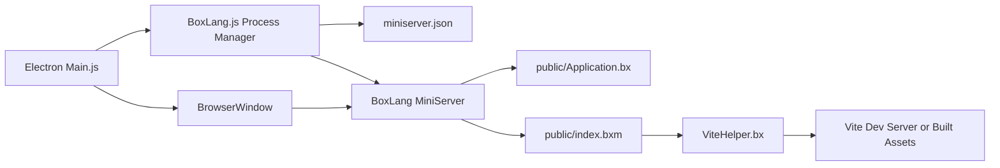
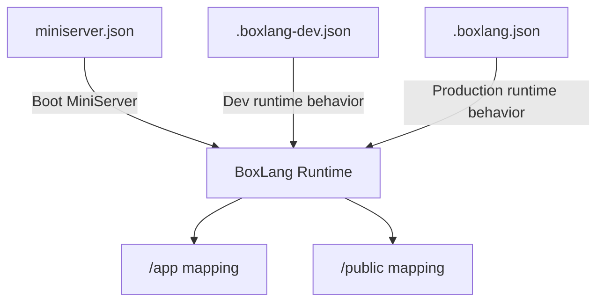

# ⚡ BoxLang Desktop Electron Starter App

```bash
|:------------------------------------------------------:|
| ⚡︎ B o x L a n g ⚡︎
| Dynamic : Modular : Productive
|:------------------------------------------------------:|
```

<blockquote>
 Copyright Since 2023 by Ortus Solutions, Corp
 <br>
 <a href="https://www.boxlang.io">www.boxlang.io</a> |
 <a href="https://www.ortussolutions.com">www.ortussolutions.com</a>
</blockquote>

<p>&nbsp;</p>

🚀 **Production-ready runtime** to build desktop apps with BoxLang, Electron, and Vite from one starter project.

## What This Starter Gives You

- BoxLang MiniServer running locally inside the desktop app
- Electron shell with menu, tray, shortcuts, and native window lifecycle
- Vite build pipeline for JS and SCSS assets
- A nice desktop theme with Bootstrap and Alpine.js
- Simple full packaging flow for macOS, Windows, and Linux

## 🧑‍💻 How it works

### Architecture diagram



### Runtime flow

1. Electron starts from `app/electron/Main.js`.
2. `Main.js` wires app modules: `AppMenu`, `TrayMenu`, `Shortcuts`, and `BoxLang`.
3. `BoxLang.js` starts MiniServer using `miniserver.json`.
4. Electron waits until the server URL is reachable, then loads it in the main window.

### MiniServer behavior

- Packaged runtime location: `runtime/bin` and `runtime/lib`.
- Packager script: `runtime/Package.bx`.
- Target version source: `.bvmrc`.
- Startup preference: packaged MiniServer first, global `boxlang-miniserver` as fallback.
- Unix self-heal: execute permissions are applied automatically when needed.
- `miniserver.json` is your main local server control file in development (host, port, webRoot, rewrites, debug, envFile).

### Runtime config files (dev vs production)

- `.boxlang-dev.json`: development runtime settings (debug and cache behavior), plus test mappings.
- `.boxlang.json`: production/runtime defaults for packaged execution.
- Both files already include the app mappings below, so your classes and templates resolve out of the box.

```json
"/app": {
 "path": "${user-dir}/app",
 "external": false
},
"/public": "${user-dir}/public"
```

> Please note that the development one includes mappings for tests and TestBox, while the production one is focused on the app and public folders.

### Config relationship diagram



### Web app layer

- `public/Application.bx`: application settings and datasource bootstrap.
- `public/index.bxm`: default landing page.
- `public/includes/helpers/ViteHelper.bx`: resolves assets for dev and production.

### Frontend layer

- Source: `resources/assets/js` and `resources/assets/scss`.
- Build config: `vite.config.mjs`.
- Output: `public/includes/resources`.

### Desktop layer

- `app/electron/Main.js`: lifecycle, logging, BrowserWindow creation.
- `app/electron/BoxLang.js`: process control, health checks, restart strategy.
- `app/electron/AppMenu.js`: app menu.
- `app/electron/TrayMenu.js`: tray menu and status.
- `app/electron/Shortcuts.js`: global keyboard shortcuts.

### Electron Resources

- `app/electron/Main.js`
  - Electron app lifecycle: <https://www.electronjs.org/docs/latest/api/app>
  - BrowserWindow: <https://www.electronjs.org/docs/latest/api/browser-window>
  - NativeImage (icons): <https://www.electronjs.org/docs/latest/api/native-image>
- `app/electron/BoxLang.js`
  - Child processes: <https://nodejs.org/docs/latest/api/child_process.html>
  - Process events/signals: <https://nodejs.org/docs/latest/api/process.html>
- `app/electron/AppMenu.js`
  - Menu: <https://www.electronjs.org/docs/latest/api/menu>
  - MenuItem: <https://www.electronjs.org/docs/latest/api/menu-item>
- `app/electron/TrayMenu.js`
  - Tray: <https://www.electronjs.org/docs/latest/api/tray>
  - Menu integration with Tray: <https://www.electronjs.org/docs/latest/tutorial/tray>
- `app/electron/Shortcuts.js`
  - globalShortcut: <https://www.electronjs.org/docs/latest/api/global-shortcut>
  - Accelerator keys: <https://www.electronjs.org/docs/latest/api/accelerator>

## 🚀 Quick Start

### Prerequisites

- BoxLang CLI (Use our [Quick Installer](https://boxlang.ortusbooks.com/getting-started/installation/boxlang-quick-installer) or [BoxLang Version Manager](https://boxlang.ortusbooks.com/getting-started/installation/boxlang-version-manager-bvm))
- Node.js 25+
- Java 21+ (required on every machine that runs the app)

> Important: this starter packages the BoxLang MiniServer runtime, but it does not package a JRE/JDK. Java 21+ must already be installed on the host machine.

### Run in development

```bash
# Install Dependencies
box install && npm install
# Start The App
npm run dev
```

### Build and package app binaries

```bash
npm run package:full
```

This command packages MiniServer and then builds the desktop app. You will find installers and binaries in the `dist/electron/` folder.

To target a specific platform explicitly:

```bash
npm run package:mac    # macOS
npm run package:win    # Windows
npm run package:linux  # Linux
```

> Packaging is handled by [Electron Forge](https://www.electronforge.io). Configuration lives in `forge.config.cjs`.

### Output artifacts per platform

| Platform | Maker | Output | Notes |
|----------|-------|--------|-------|
| macOS | DMG | `.dmg` | Primary macOS installer |
| macOS | PKG | `.pkg` | Flat package / Mac App Store — only built when `MAC_SIGNING_IDENTITY` is set |
| All | ZIP | `.zip` | Archive fallback; produced on every platform |
| Windows | Squirrel | `.exe` | No-admin, no-prompt installer — requires Windows host (CI only); macOS produces `.zip` only |
| Linux | deb | `.deb` | Debian / Ubuntu |
| Linux | rpm | `.rpm` | RHEL / Fedora |
| Linux | Flatpak | `.flatpak` | Sandboxed, distribution-agnostic |

### Building Linux packages on macOS

`.deb` can be produced locally on macOS for testing with Homebrew tools:

```bash
brew install dpkg fakeroot
```

`.rpm` and `.flatpak` require a real Linux host (`rpmbuild` and `flatpak-builder` depend on Linux filesystem paths). Build those via CI (`ubuntu-latest`), a Linux VM, or Docker (see below).

### Building Linux packages with Docker

A Dockerfile is included for building all Linux packages from macOS (or Windows):

```bash
# First time: package the MiniServer runtime (one-time, or after .bvmrc changes)
npm run package:miniserver

# Build Linux packages inside an Ubuntu container
npm run package:linux:docker
```

This builds the image from `Dockerfile.linux-build` and runs it with your project bind-mounted. A named Docker volume (`boxlang_linux_node_modules`) is used for Linux-native `node_modules` so they don't conflict with your macOS install. Output lands in `dist/electron/` on your host.

> `flatpak-builder` requires `--privileged` (already included in the script). Remove that flag if you don't need Flatpak.

## 🔬 Most Important Scripts

| Script | Description |
|--------|-------------|
| `npm run dev` | Vite + Electron development mode |
| `npm run build` | Build frontend assets |
| `npm run package:miniserver` | Download MiniServer runtime from `.bvmrc` |
| `npm run package` | Build assets and package the desktop app with Electron Forge (current platform) |
| `npm run package:mac` | Build and package for macOS (`.dmg`, `.pkg`, `.zip`) |
| `npm run package:win` | Build and package for Windows (Squirrel `.exe`, `.zip`) |
| `npm run package:linux` | Build and package for Linux (`.deb`, `.rpm`, `.flatpak`, `.zip`) |
| `npm run package:linux:docker` | Build Linux packages inside an Ubuntu Docker container (macOS/Windows cross-build) |
| `npm run package:full` | Package MiniServer first, then build and package the desktop app |

## ⌨ Where Developers Usually Edit

- UI pages and templates: `public/`
- Frontend behavior and styles: `resources/assets/`
- Backend behavior: `app/**`
- Desktop behavior (window, tray, menu, shortcuts): `app/electron/`
- Runtime config: `miniserver.json`

## 🥷 AI Skills Included

This repository includes AI skills that help coding agents work with BoxLang patterns.

- Main skills folder: `.agents/skills/`
- Mirror skills folder: `.claude/skills/`
- Lock file for managed skill versions: `skills-lock.json`

### Keeping Skills Up to Date

Skills are managed via the `skills` CLI. To update all project skills to their latest versions:

```bash
npx skills update
```

To add a new skill package:

```bash
npx skills add ortus-boxlang/skills
```

To list currently installed skills:

```bash
npx skills list
```

If you add new project conventions, update the relevant skill or instruction so agents use them consistently.

## 🏗 Running Builds (Unsigned)

CI builds are not code-signed. Each OS has a security mechanism that blocks
unsigned apps downloaded from the internet. Every ZIP release includes helper
scripts and a `UNSIGNED-BUILD.md` that explains this in detail.

### macOS — Gatekeeper

macOS will show *"is damaged and can't be opened"* for unsigned apps. The app
is not damaged — it just lacks an Apple Developer ID signature.

**Option 1 — helper script (in the ZIP):**

```bash
bash mac-open.sh
```

**Option 2 — manual:**

```bash
xattr -cr "/path/to/BoxLang Starter Desktop.app"
open "/path/to/BoxLang Starter Desktop.app"
```

**Option 3 — right-click:** Right-click the `.app` → **Open** → **Open**.

### Windows — SmartScreen

Windows will show *"Windows protected your PC"* for unsigned executables.

**Option 1 — helper script (in the ZIP):**

```powershell
.\win-unblock.ps1
```

**Option 2 — manual:** Right-click the `.exe` → **Properties**
→ check **Unblock** → **OK**.

**Option 3 — SmartScreen dialog:** Click **More info** → **Run anyway**.

### Linux

No quarantine mechanism. Install normally:

```bash
# Debian / Ubuntu
sudo dpkg -i "boxlang-starter-desktop_*.deb"

# RHEL / Fedora
sudo rpm -i "boxlang-starter-desktop-*.rpm"

# Flatpak
flatpak install --user "boxlang-starter-desktop-*.flatpak"
```

## ✍️ Signing Your Builds

Code signing removes the "untrusted app" warnings that end users otherwise see. Electron Forge handles signing at the **Package** (macOS) and **Make** (Windows) steps — you only need to supply credentials via environment variables.

Full Forge docs: <https://www.electronforge.io/guides/code-signing>

### macOS — Sign + Notarize

macOS requires both **code signing** (Apple Developer ID Application certificate) and **notarization** (automated Apple malware scan) for apps distributed outside the Mac App Store.

**Prerequisites:**

1. Enroll in the [Apple Developer Program](https://developer.apple.com/programs/) ($99/yr).
2. Install Xcode and download a **Developer ID Application** certificate from Xcode → Settings → Accounts.
3. Verify: `security find-identity -p codesigning -v`

**`forge.config.cjs` additions:**

```js
packagerConfig: {
  osxSign: {}, // empty object enables signing with auto-detected identity
  osxNotarize: {
    appleId: process.env.APPLE_ID,
    appleIdPassword: process.env.APPLE_PASSWORD, // app-specific password, not your login
    teamId: process.env.APPLE_TEAM_ID
  }
}
```

**CI environment variables to set:**

| Variable | Description |
|----------|-------------|
| `APPLE_ID` | Your Apple ID email |
| `APPLE_PASSWORD` | App-specific password from [appleid.apple.com](https://appleid.apple.com) |
| `APPLE_TEAM_ID` | 10-character team ID from Apple Developer portal |
| `MAC_SIGNING_IDENTITY` | Enables the PKG maker (already wired in `forge.config.cjs`) |

Full guide: <https://www.electronforge.io/guides/code-signing/code-signing-macos>

---

### Windows — Sign with a Certificate

Windows apps are signed at the **Make** step on the Squirrel installer.

**Option 1 — Traditional `.pfx` certificate** (OV/EV from DigiCert, Sectigo, etc.):

> **Note:** Since June 2023, private keys must be stored on a FIPS 140 Level 2+ hardware token. Software-only OV certificates are no longer issued. Consult your CA for token-based signing.

The `certificateFile` / `certificatePassword` fields are already present in `forge.config.cjs`:

```js
// maker-squirrel config — already in forge.config.cjs
certificateFile:     process.env.WIN_CERT_FILE || undefined,
certificatePassword: process.env.WIN_CERT_PASS || undefined
```

Set `WIN_CERT_FILE` (path to `.pfx`) and `WIN_CERT_PASS` in your CI environment.

**Option 2 — Azure Trusted Signing** (cheapest, cloud-based, eliminates SmartScreen):

1. Set up [Azure Trusted Signing](https://azure.microsoft.com/en-us/products/trusted-signing) in your Azure account.
2. Install `dotenv-cli`: `npm i -D dotenv-cli`
3. Update `@electron/windows-sign` to 1.2.2+: `npm update @electron/windows-sign`
4. Create `.env.trustedsigning` (add to `.gitignore`):

```env
AZURE_CLIENT_ID=xxx
AZURE_CLIENT_SECRET=xxx
AZURE_TENANT_ID=xxx
AZURE_METADATA_JSON=C:\path\to\metadata.json
AZURE_CODE_SIGNING_DLIB=C:\path\to\Azure.CodeSigning.Dlib.dll
SIGNTOOL_PATH=C:\path\to\signtool.exe
```

1. Prefix forge commands with `dotenv -e .env.trustedsigning --`:

```json
"package:win": "dotenv -e .env.trustedsigning -- electron-forge make --platform win32"
```

Full guide: <https://www.electronforge.io/guides/code-signing/code-signing-windows>

---

## 🆘 Troubleshooting

### Server fails to start

- Run `npm run package:miniserver` to ensure `runtime/bin` and `runtime/lib` exist.
- If using global fallback, confirm `boxlang-miniserver` is on your `PATH`.
- Verify `miniserver.json` port is available.

### Permission denied on macOS/Linux

- Re-run `npm run package:miniserver:force`.
- If needed, run `chmod +x runtime/bin/boxlang-miniserver`.

### Missing production assets

- Run `npm run build` and confirm `public/includes/resources/.vite/manifest.json` exists.

## License

Apache-2.0

## Ortus Sponsors

BoxLang is a professional open-source project and it is completely funded by the [community](https://patreon.com/ortussolutions) and [Ortus Solutions, Corp](https://www.ortussolutions.com).  Ortus Patreons get many benefits like a cfcasts account, a FORGEBOX Pro account and so much more.  If you are interested in becoming a sponsor, please visit our patronage page: [https://patreon.com/ortussolutions](https://patreon.com/ortussolutions)

### THE DAILY BREAD

 > "I am the way, and the truth, and the life; no one comes to the Father, but by me (JESUS)" Jn 14:1-12
